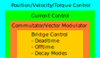
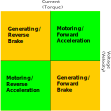

=============
Motor Control
=============

This section describes the principles of motor control at a low level.

Electrical Commutation
======================

Electrical commutation is the process of generating rotating magnetic fields in
an electromagnetic system. In electric motors this involves the generation of AC and DC
signals. Some simple motors may do this mechanically, however for precision applications
such as robotics and manufacturing it is done with digital control systems. 

Many types of motors may be controlled with electrical commutation:

* Brushless DC
* Induction
* Stepper
* Switched Reluctance

There are of course many innovative topologies being developed every year, and
many of these use the same operating principles as the above. RAPcores aims
to provide a toolkit for controlling a wide range of motor types.

The two basic elements of a motor controller are:

* Power systems
* Control systems

The power systems element is the element that handle the (relatively) high
power that drives the motor. Typically MOSFETs or IGBTs are used in full or H bridge
inverter configurations to generate AC voltages. It may include additional sensors such as an
encoder, voltage sensor, and current sensor. All three are preferred for
closed-loop control.  

The control systems element is the software or digital logic system managing
inputs and outputs of the power circuitry, sensors, and input trajectories.
In RAPcores the low levels of this are handled in FPGA or ASIC, with a
microcontroller or CPU handling high level trajectory planning. The job of the
control system is to ensure the motor is following the defined trajectory or
set behavior. 

Bridge Control
==============

Below is a simple motor control hierarchy:

Bridge control involves the timing of output signals such that
the motor power circuitry creates the desires voltage and current
in each coil of the motor. In addition, it needs to be fault aware
and control timing to create smooth operation. Typically high-resolution
PWM signals are used at supra-audible frequencies (>35kHz). 

Due to the use of PWM and commutation, the voltages are non-contant. There
are some timing considerations when switching the motor:

* Dead time
* Off time
* On time
* Blank time

Dead time is the time required for a transistor in the bridge to turn on or off.
When switching polarities, it is important the controller wait this "dead time",
or delay, before changing the direction of the inverter otherwise breakage might occur.

Off time and On time are the duration the PWM signal is on or off. The relation of
these two is relevant to current and voltage measurements of the motor. Measuring
voltage and current over time allows for measurement of resistance and inductance
in the motor.

Blank time is related to the propogation delay of measuring the outputs to the motor.
Since a digital design can react on a cycle-to-cycle basis of the PWM, delays
must be accounted in elements such as ADCs and comparators before measuring 
then reacting to a change in the power output.

Motor Fault Types
=================

The following faults may occur in a motor: 

* Disconnection
* Overcurrent
* Undervoltage
* Thermal Shutdown
* Overvoltage

A good bridge design should be able to handle the majority of these
fault conditions and report back to higher level controllers for
rectification by the user or path planner. In RAPcores there are
fault diagnostic registers for each motor channel.

Space Vector Modulation
=======================

The key to smooth and efficient motor control is a high precision electrical commutator.
To achieve this, precise currents and voltages must be generated. Moreover, they
must rotate the magnetic field at a wide variety of speeds and accelerations.
As mentioned, PWM signals are used to control the power output and to rotate the
magnetic field with PWM, we use a Space Vector Modulator. 

Two elements are required for Space Vector Modulation or SVM:

* Microstepping (subdividing the commutation table)
* Current regulation (limiting power output for efficiency)

To understand the concepts and mathematics of the rotating magnetic field,
we will use vectors and phasors.

Vector Concepts
---------------

Here we will present the mathematical ideas of how to model a rotating magnetic field in a bipolar stepper
motor as a vector. This is known as `Space Vector Modulation <https://en.wikipedia.org/wiki/Space_vector_modulation>`_.
To start we must understand some basic concepts from vector algebra and trigonometry.

Recall that sine and cosine are derived from the components of a vector rotating around the origin:

.. image:: https://upload.wikimedia.org/wikipedia/commons/b/bd/Sine_and_cosine_animation.gif

And recall the identity where:

.. math::
  cos(\theta)^2+sin(\theta)^2=1

Or alternatively:

.. math::
  A \cdot cos(\theta)^2+A \cdot sin(\theta)^2=A

The above equation is essential in our understanding of constructing the vector. Recall the phase table for the bipolar stepper:

== ==
A  B 
== ==
\+ \- 
\- \- 
\- \+ 
\+ \+ 
== ==

If we visualize each phase as a 2D plot we can see these commutation steps form the corners of a square as shown below:

.. image:: ./img/bipolar-svm.svg

Microstepping is possible in this space (a square), however it yields undesirable effects since the total current in the motor
varies due to a change of vector length as shown in the red arrow above. This can yield resonance and torque ripples. The objective
is to create smooth motion as we traverse between the phases. Therefore we need to move our vector along a circle, such as the arrows in blue above. The trade-off is
that we do not achieve the peak torque attainable in the corners of the square, but instead the motion is smooth and controllable.

PWM Concepts
------------

Below is a simple PWM module in verilog:

.. code-block:: verilog
  :linenos:

    /*
    Simple PWM module
    */
    module pwm #(
        parameter bits = 8
    ) (
        input  clk,
        input  resetn,
        input  [bits-1:0] val,
        output pwm
    );

      reg [bits-1:0] accum;
      assign pwm = (accum < val);

      always @(posedge clk)
      if(!resetn)
        accum <= 0;
      else if(resetn)
        accum <= accum + 1'b1;

    endmodule

We can see that the PWM output frequency is a function of the base clock frequency (`clk`) and the number of bits used for the accumulator. E.g.:

.. math::

  F_{PMW} = \frac{F_{clk}}{2^{bits}}

For quiet operation and fast updates we want the PWM frequency to be superaudible, so a value greater than 30khz. Assume we use a PLL to achieve
a higher operational frequency for `PWM` module at 150mhz. The bit resolution of the PWM can be calculated thus:

.. math::

  bits = \log_2({F_{PMW}/F_{clk}})

In our example of a 30khz output with a 150mhz accumulator clock we get ~12.3 bit resolution. For simplicity we will use 12 bits going forward.

Now the challenge is how to compute the value to the PWM such that we bring both the current and the microstep/phase angle into a single value.
In the next section we will see this is a relatively straight forward process that falls out of the vector model.

Applied Space Vector Modulation
-------------------------------

Recall that a vector (:math:`\vec{A}`) may be element-wise scaled by a given factor such that the length (:math:`\left\lVert\vec{A}\right\rVert`) is scaled by the same factor.
Our vector is formed from a given angle (or microstep position) :math:`\theta` as: :math:`(cos(\theta), sin(\theta))`. Then scaling the current is simply multiplication of this vector
by a factor `C`: :math:`(C \cdot cos(\theta), C \cdot sin(\theta))`. Then using the above identify we known that the length of this vector is:

.. math::
  \left\lVert(C \cdot cos(\theta), C \cdot sin(\theta))\right\rVert = C

Then the matter of partitioning the 12 bit space of the PWM become quite simple. For example we may use 8 bits for the trigonometric functions (implemented as lookup tables in practice), and 4 bits for current.
Which gives sufficient precision for 64 microsteps and 16 discrete current values.

So now we can do space vector modulation. But where do we put it? The answer is as a voltage reference or gate PWM input. For example we may use this output to
create a reference for a 1-bit ADC by adding a RC filter to the output in a `chopper drive <https://en.wikipedia.org/wiki/Chopper_(electronics)>`_. 
Or for a dead-reckoned approach this PWM can be used to quickly turn the gate drivers on and off. An example of this can be found in the RAPcores Dual H Bridge module.

SVM in Three Phase
------------------

For the mathematically inclined, you may notice that the bipolar stepper is nice
as the phases form an orthonormal basis in 2D space. In three phase or more motors, this is not the case,
as the vector is embedded in three or more dimensional space.

The technique used in three phase control is to project the three dimensional vector down into a two dimensional
space such that we can use simpler math for the control. In addition, the inverse may be applied, bringing us
from the two dimensional frame of reference to the three dimensional frame of reference for the three phase motor.

The forward transform:

.. math::
  i_{\alpha\beta}(t) = \frac23 \begin{bmatrix} 1 & -\frac12 & -\frac12\\ 
  0 & \frac{\sqrt{3}}{2} & -\frac{\sqrt{3}}{2}
  \end{bmatrix}\begin{bmatrix}i_a(t)\\i_b(t)\\i_c(t)\end{bmatrix}

The inverse transform:

.. math::
  i_{abc}(t) = \frac32\begin{bmatrix} \frac23 & 0 \\
  -\frac{1}{3} & \frac{\sqrt{3}}{3} \\
  -\frac{1}{3} & -\frac{\sqrt{3}}{3} \end{bmatrix}
  \begin{bmatrix}i_\alpha(t)\\i_\beta(t)\end{bmatrix}

Frequency Considerations
========================

Below is a table showing some relevant stepping frequencies for a stock Prusa MK3S:

======================== =====  ===== ======  =====
Prusa MK3S               X      Y     Z       E
======================== =====  ===== ======  =====
Full Steps/rev           200    200   200     200
Microsteps               16     16    16      32
Homing Feedrate (mm/sec) 50     50    13.3  
Max travel Rate (mm/sec) 200    200   12      120
(Steps*microsteps)/mm    100    100   400     280
Microsteps/sec (travel)  20000  20000 4800    33600
Full Steps/sec (travel)  1250   1250  300     1050
Microsteps/sec (homing)  5000   5000  5333.3
Full Steps/sec (homing)  312.5  312.5 333.3
======================== =====  ===== ======  =====

Commutation Tables
==================

Bipolar Stepper
---------------

== ==
A  B 
== ==
\+ \- 
\- \- 
\- \+ 
\+ \+ 
== ==

Three Phase (BLDC, Induction)
-----------------------------

 == == ==
 A  B  C 
 == == ==
 \+ \- \  
 \+ \  \- 
 \  \+ \- 
 \- \+ \  
 \- \  \+ 
 \  \- \+ 
 == == ==

Five Phase Stepper
------------------

 == == == == ==
 A  B  C  D  E 
 == == == == ==
 \+ \  \- \- \  
 \+ \+ \  \- \  
 \  \+ \  \- \- 
 \  \+ \+ \  \- 
 \- \  \+ \  \- 
 \- \  \+ \+ \  
 \- \- \  \+ \  
 \  \- \  \+ \+ 
 \  \- \- \  \+ 
 \+ \  \- \  \+ 
 == == == == ==

Analytical Models
=================

Stepper Motor
-------------

A model of a hybrid stepper motor is given by Bodson, et. al.: [1]

.. math::
  \frac{d \theta}{dt} = \omega
.. math::
  \frac{d \omega}{dt} = ( -K_m i_a sin(N_r \theta) + K_m i_b cos(N_r \theta) - B \omega - \tau)/J
.. math::
  \frac{d i_a}{dt} = ( v_a - R i_a + K_m sin(N_r \theta))/L
.. math::
  \frac{i_b}{dt} = ( v_b - R i_b - K_m cos(N_r \theta))/L

Where:

* :math:`\omega` - Angular Velocity
* :math:`\theta` - Angular Position
* :math:`J` - Rotor and Load Inertia
* :math:`K_m` - Motor Torque constant
* :math:`L` - Coil Inductance
* :math:`R` - Coil Resistance
* :math:`N_r` - Number of rotor teeth
* :math:`i_a, i_b` - Coil Current
* :math:`v_a, v_b` - Coil Current

From this a simpler model for the current can be developed:

.. math::
  i_{qr} = \frac{J}{K_m} \alpha_r + \frac{B}{K_m} \omega_r

Motoring Quadrants
------------------

Motoring quadrants are the four possible states a rotor and stator may take. Assuming
the stator is the driving portion and the rotor is connected to the load, either maybe
generating torque in conjunction or opposition to the desired motoring trajectory.
These states are illustrated below:

References
==========

[1]M. Bodson and J. N. Chiasson, “High-Performance Nonlinear Feedback Control of a Permanent Magnet Stepper Motor,” p. 10.
