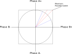

=============
Motor Control
=============

This section describes the principles of motor control at a low level.

Definitions
===========

- Integrated Driver - A IC taking step/direction signals with onboard logic for commutation and microstepping
- Commutation - The process of controlling an electrical bridge for
- Full Bridge - A center-tapped transistor circuit allowing for either high or low (ground) voltage
- H-Bridge - Two full bridges allowing for bidirectional current flow

Electrical Commutation
======================

Electrical commutation is the process of timing and controlling electrical current in the
windings of a motor. In years past you might use a brushed DC or induction motor, plug it
into you power supply or wall mains outlet and that would be it. The reason the hookup
for brushed DC is simple is due to electrical contacts called commutators. With induction
motors your mains AC voltage will generate a rotating potential in the motor making it spin,
which is also a form of commutation.

However, modern brushless motors require much more logic and control to perform their best.
First, since brushless motors (e.g. Steppers, BLDC) do not have electro-mechanical commutation
(hence the name "brush-less"), we need to digitally switch the motor coils on and off.
This is accomplished with arrays of transistors called "bridges" that allow for bidirectional
current flow. By controlling these bridges we can generate alternative voltages that make
the motor spin.

In contrast to integrated drivers e.g. that take PWM for BLDC, or step/direction for steppers,
the approach in RAPcores is to provide higher level APIs tailored for the application or
action. Some examples:

- "S"-curve stepping algorithms
- Sensorless homing
- Torque control

Commutation Tables
==================

Bipolar Stepper
---------------

== ==
A  B 
== ==
\+ \- 
\- \- 
\- \+ 
\+ \+ 
== ==

Three Phase (BLDC, Induction)
-----------------------------

 == == ==
 A  B  C 
 == == ==
 \+ \- \  
 \+ \  \- 
 \  \+ \- 
 \- \+ \  
 \- \  \+ 
 \  \- \+ 
 == == ==

Five Phase Stepper
------------------

 == == == == ==
 A  B  C  D  E 
 == == == == ==
 \+ \  \- \- \  
 \+ \+ \  \- \  
 \  \+ \  \- \- 
 \  \+ \+ \  \- 
 \- \  \+ \  \- 
 \- \  \+ \+ \  
 \- \- \  \+ \  
 \  \- \  \+ \+ 
 \  \- \- \  \+ 
 \+ \  \- \  \+ 
 == == == == ==

Space Vector Modulation
=======================

The key to smooth and efficient motor control is current regulation.
Through current regulation in a motor, one can accomplish a few valuable things:

- Microstepping (subdividing the commutation table)
- Current regulation (limiting power output for efficiency)

With closed loop current regulation, e.g. through a current sense resistor, additional
capabilities are also achieved:

- Fault detection
- Phase shift and skip detection

Vector Concepts
---------------

Here we will present the mathematical ideas of how to model the target current in a bipolar stepper
motor as a vector. This is known as `Space Vector Modulation <https://en.wikipedia.org/wiki/Space_vector_modulation>`_.
To start we must understand some basic concepts from vector algebra and trigonometry.

Recall that sine and cosine are derived from the components of a vector rotating around the origin:

.. image:: https://upload.wikimedia.org/wikipedia/commons/b/bd/Sine_and_cosine_animation.gif

And recall the identity where:

.. math::
  cos(\theta)^2+sin(\theta)^2=1

Or alternatively:

.. math::
  A \cdot cos(\theta)^2+A \cdot sin(\theta)^2=A

The above equation is essential in our understanding of constructing the vector. Recall the phase table for the bipolar stepper:

== ==
A  B 
== ==
\+ \- 
\- \- 
\- \+ 
\+ \+ 
== ==

If we visualize each phase as a 2D plot we can see these commutation steps form the corners of a square as shown below:

Microstepping is possible in this space (a square), however it yield undesirable effects since the total current in the motor
varies due to a change of vector length as shown in the red arrow above. This can yield resonance and torque ripples. The objective
is to create smooth motion as we traverse between the phases. Therefore we need to move our vector along a circle, such as the arrows in blue above. The tradeoff is
that we do not achieve the peak torque attainable in the corners of the square, but instead the motion is smooth and controllable.

PWM Concepts
------------

.. code-block:: verilog
  :linenos:

    /*
    Simple PWM module
    */
    module pwm #(
        parameter bits = 8
    ) (
        input  clk,
        input  resetn,
        input  [bits-1:0] val,
        output pwm
    );

      reg [bits-1:0] accum;
      assign pwm = (accum < val);

      always @(posedge clk)
      if(!resetn)
        accum <= 0;
      else if(resetn)
        accum <= accum + 1'b1;

    endmodule

